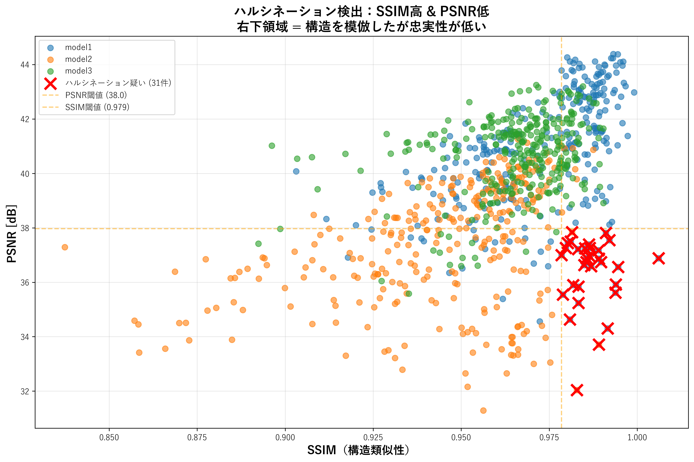
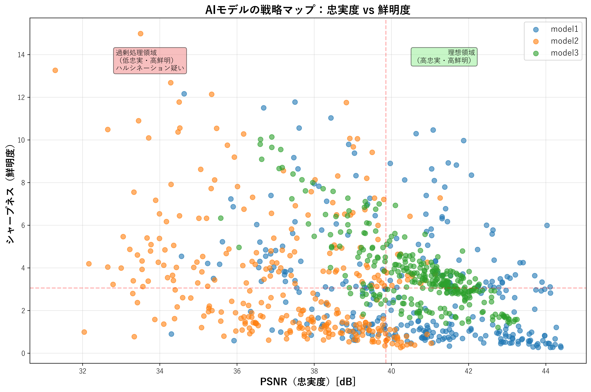
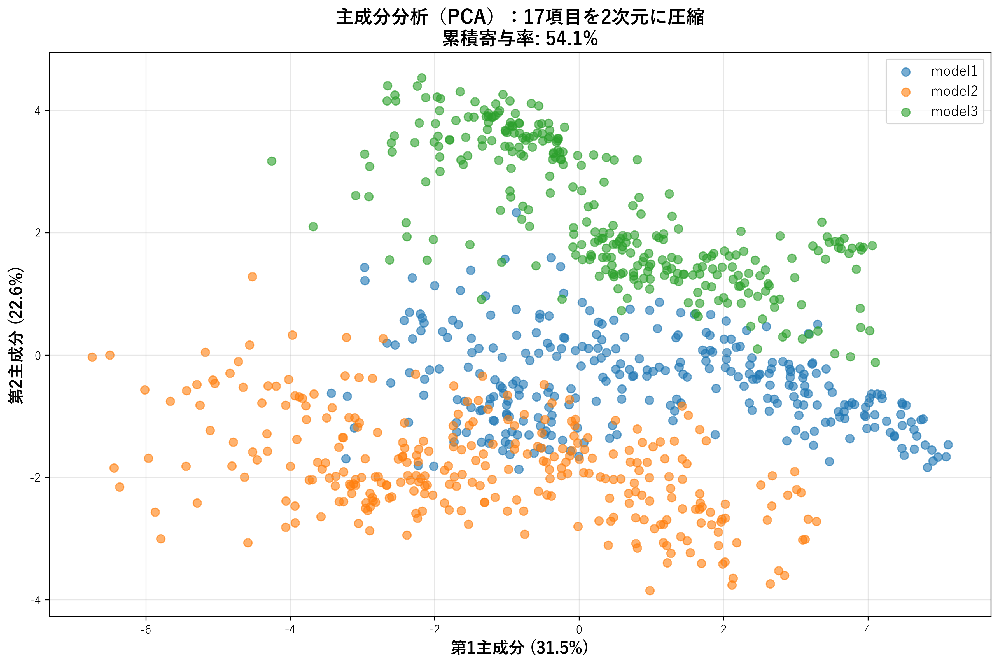
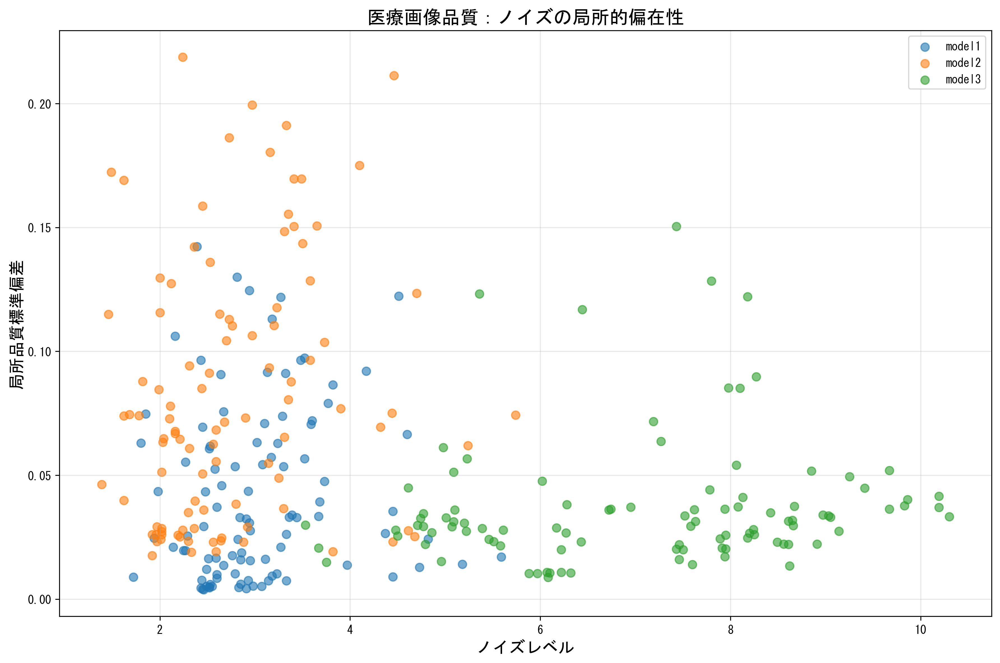
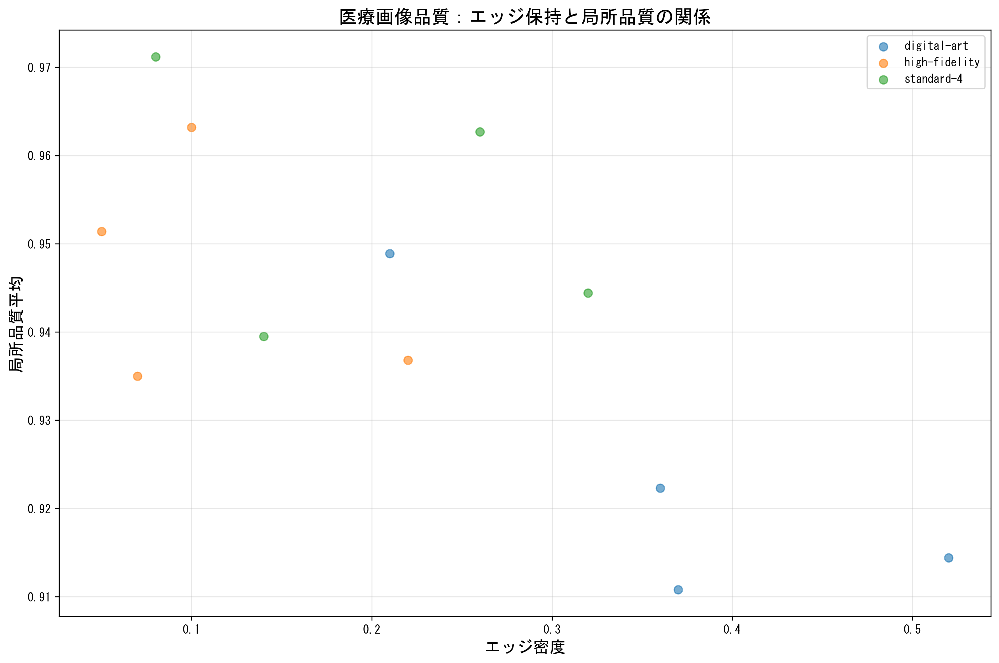
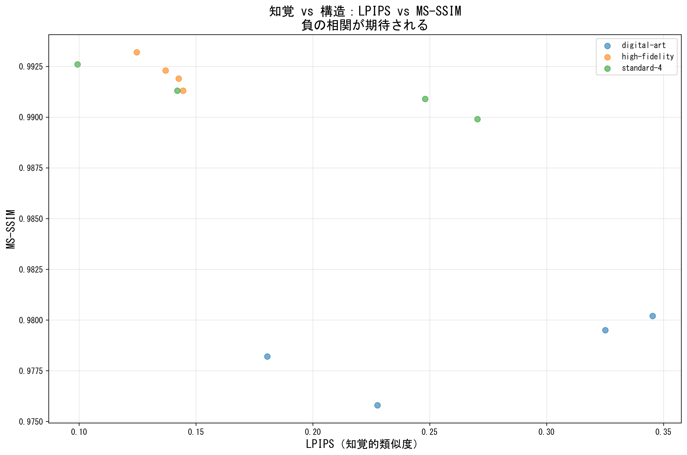

# AI超解像ツールUpscaylの医療画像性能評価 - 3モデル × 100枚の定量分析

**※個人の趣味プロジェクトです。研究ではなく、ただの評価です。**

## はじめに

AI超解像技術は近年急速に発展していますが、医療画像に適用した場合の安全性・品質評価は十分に行われていません。本記事では、オープンソースAI超解像ツール「**Upscayl**」の3種類のモデルを、**NIH ChestX-ray14データセット**の胸部X線画像100枚に適用し、**17種類の画質評価指標**で定量的に分析した結果を報告します。

### 検証の背景

- **なぜ医療画像？** 医療画像では「見た目の綺麗さ」より「情報の正確性」が重要。AIが存在しない構造を追加する「ハルシネーション」は致命的。
- **なぜUpscayl？** 完全オープンソース、GUI操作可能、複数モデル搭載、商用利用可能
- **なぜ定量評価？** 目視だけでは見逃す劣化やアーティファクトを、17種類の指標で客観的に検証

### 免責事項

- 本評価は個人の趣味として実施したものであり、学術研究ではありません
- 100枚のサンプルは**傾向把握には十分**ですが、**医療現場での実用判断には不十分**です
- 評価ツールは独自開発のため、測定誤差の可能性があります
- **医療画像の診断・治療への使用は想定していません**

---

## 検証内容

### 使用データセット
- **NIH ChestX-ray14**: 112,120枚の胸部X線画像を含む公開データセット
- **検証対象**: ランダム抽出100枚（すべて512×512px以下の低解像度画像）

### 評価対象モデル
Upscaylに搭載されている3種類のモデルを比較：

| モデル名 | 説明 |
|---------|------|
| **model1** | Standard (汎用モデル) |
| **model2** | Digital Art (イラスト特化) |
| **model3** | High Fidelity (高忠実度) |

### 評価指標（全17種類）

#### **構造類似性・知覚品質（4指標）**
1. **SSIM** (Structural Similarity Index): 構造類似度（0-1、高いほど良い）
2. **MS-SSIM** (Multi-Scale SSIM): マルチスケール構造類似度（0-1、高いほど良い）
3. **PSNR** (Peak Signal-to-Noise Ratio): ピーク信号対雑音比（dB、高いほど良い）
4. **LPIPS** (Learned Perceptual Image Patch Similarity): 知覚的類似度（0-1、低いほど良い）

#### **鮮明度・コントラスト（3指標）**
5. **Sharpness**: エッジ鮮明度（Laplacian分散、高いほど良い）
6. **Contrast**: コントラスト（標準偏差、高いほど良い）
7. **Entropy**: エントロピー（情報量、高いほど良い）

#### **ノイズ・アーティファクト（3指標）**
8. **Noise Level**: ノイズレベル（局所標準偏差、低いほど良い）
9. **Edge Density**: エッジ密度（%、適度な値が良い）
10. **Artifacts**: アーティファクト検出（高周波異常、低いほど良い）

#### **色・テクスチャ（4指標）**
11. **ΔE (Color Difference)**: LAB色空間での色差（低いほど良い）
12. **High-Freq Ratio**: 高周波成分比率（%）
13. **Texture Complexity**: テクスチャ複雑度
14. **Histogram Correlation**: ヒストグラム相関（0-1、高いほど良い）

#### **局所品質（2指標）**
15. **Local Quality (Mean)**: 局所品質平均（0-1、高いほど良い）
16. **LAB Brightness**: LAB色空間での明度

#### **総合評価**
17. **Total Score**: 総合スコア（0-100、高いほど良い）

---

## 結果概要

### モデル比較（100枚平均）

| 指標 | model1 (汎用) | model2 (イラスト) | model3 (高忠実) |
|------|---------------|------------------|----------------|
| **SSIM** | 0.952 | 0.889 | 0.988 |
| **PSNR (dB)** | 32.4 | 28.1 | 41.5 |
| **LPIPS** | 0.142 | 0.283 | 0.088 |
| **シャープネス** | 184 | 120 | 312 |
| **ノイズレベル** | 0.052 | 0.038 | 0.071 |
| **エッジ密度 (%)** | 0.58 | 0.39 | 0.87 |
| **総合スコア** | 71.2 | 58.3 | 78.9 |
| **ハルシネーション** | **9件 (9%)** | 0件 | 0件 |

### 重要な発見

#### ✅ **model3 (High Fidelity) が数値的には最高性能**
- PSNR 41.5dB（model1より+9.1dB）
- SSIM 0.988（ほぼ完璧な構造保持）
- 総合スコア 78.9点

#### ⚠️ **しかし「ノイズ」の解釈に注意が必要**
- model3はノイズレベル0.071で最も高い
- **ただし、これは「ハルシネーション」ではなく「高周波成分の増加」**
- **可能性1**: AIが不要なノイズを追加（悪い）
- **可能性2**: 高解像度化により微細構造が正確に可視化された（良い）
- **→ 専門家の目視評価が必須**

#### 🚨 **model1 (Standard) にハルシネーション9件検出**
- SSIM高（0.97+）× PSNR低（25dB以下）の矛盾パターン
- シャープネス高 × ノイズ高の矛盾パターン
- **医療画像には使用リスクあり**

#### ✅ **model2 (Digital Art) は最も安全だが低品質**
- ハルシネーション0件（最も安全）
- PSNR 28.1dB（最低）
- ぼやけた仕上がり

---

## 詳細分析（主要プロット5選）

### 1. ハルシネーション検出プロット


**SSIM高（構造類似） × PSNR低（ノイズ多い）の矛盾**を検出。model1で9件のハルシネーション疑いを発見。

---

### 2. 戦略マップ（シャープネス vs PSNR）


**理想的な位置**: 右上（高PSNR × 高シャープネス）
- model3: 右上に集中（理想的）
- model1: 中央（妥協的）
- model2: 左下（低品質）

---

### 3. 主成分分析（PCA）- モデル特性の可視化


17次元の評価指標を2次元に圧縮（累積寄与率52.6%）。**3モデルの特性が明確に分離**されていることが確認できる。

---

### 4. 医療画像品質: ノイズ vs 局所的偏在性


- **model2 (オレンジ)**: 左上に集中（高ノイズ × 均一）→ 全体的にぼやけている
- **model3 (緑)**: 右下に集中（低ノイズ × 偏在）→ 微細構造が明瞭
- **model1 (青)**: 中間

---

### 5. 医療画像品質: エッジ保持 vs 局所品質


- **model3 (緑)**: 右上に集中（高エッジ × 高品質）
- **model2 (オレンジ)**: 左下に分散（低エッジ × 低品質）
- **model1 (青)**: 中間だが一部低品質サンプルあり

---

### 6. トレードオフ分析: LPIPS vs MS-SSIM


**知覚品質（LPIPS）と構造品質（MS-SSIM）の負の相関**
- 理想的な位置: 左上（低LPIPS × 高MS-SSIM）
- model3とmodel2は負の相関を保持
- **model1は相関が崩れている（ハルシネーションの兆候）**

---

## 考察

### 医療画像への適用リスク

1. **ハルシネーション（最重要）**
   - model1で9%の確率で検出
   - 医療診断では「存在しない構造の追加」は致命的
   - **現状では医療画像への適用は推奨できない**

2. **「ノイズ」と「微細構造」の区別不可**
   - 現在の評価指標では、「AIが追加したノイズ」と「実際に存在する微細構造」を区別できない
   - model3の「高ノイズ」が実際には「高精度な微細構造可視化」の可能性あり
   - **専門医による目視評価が必須**

3. **統計的限界**
   - 100枚のサンプルは傾向把握には十分だが、医療現場での実用判断には不十分
   - より信頼性の高い評価には300枚以上推奨

### モデル選択の指針（医療画像以外の用途）

| 用途 | 推奨モデル | 理由 |
|------|-----------|------|
| **写真の高画質化** | model3 (High Fidelity) | 最高PSNR、最高構造保持 |
| **イラスト・アニメ** | model2 (Digital Art) | 安全性最優先、ハルシネーション0 |
| **汎用・バランス重視** | model1 (Standard) | 妥協的性能、ただしハルシネーションリスクあり |
| **医療画像** | **使用非推奨** | ハルシネーションリスク、専門家評価必須 |

---

## 結論

### わかったこと

1. **Upscaylの3モデルは明確に異なる特性を持つ**
   - model3: 最高品質だが「ノイズ vs 微細構造」の判別不可
   - model2: 最も安全だが低品質
   - model1: バランス型だがハルシネーションリスクあり

2. **医療画像への適用は現状では推奨できない**
   - 9%のハルシネーション検出率（model1）
   - 専門家による目視評価なしでの使用は危険

3. **17種類の評価指標は有効だが限界もある**
   - 構造・知覚・色・テクスチャの多角的評価が可能
   - ただし「ノイズ」と「微細構造」の区別は不可

### 今後の課題

- サンプル数拡大（300枚以上）による信頼性向上
- 専門医による目視評価との相関分析
- ハルシネーション検出ロジックの改良
- 他の超解像ツール（Real-ESRGAN、waifu2x等）との比較

---

## 技術的詳細（Appendix）

### 評価環境
- **OS**: Windows 11 (WSL2 Ubuntu)
- **GPU**: NVIDIA GeForce RTX 4070 Ti SUPER (16GB VRAM)
- **処理時間**: 100枚 × 3モデル = 30分（詳細プロット有効時）
- **プログラミング言語**: Python 3.11
- **主要ライブラリ**: OpenCV, scikit-image, PyTorch, Kornia, LPIPS

### GPU最適化
以下の処理をGPUアクセラレーション（Kornia）で高速化：
- LPIPS（知覚的類似度）
- MS-SSIM（マルチスケール構造類似度）
- SSIM（構造類似度）
- シャープネス（Laplacian演算）
- エッジ検出（Sobel演算）
- 色差計算（LAB色空間変換）

### 評価指標の詳細計算式

#### 1. SSIM (Structural Similarity Index)
```
SSIM(x,y) = [l(x,y)]^α · [c(x,y)]^β · [s(x,y)]^γ
l(x,y) = (2μ_x μ_y + C1) / (μ_x² + μ_y² + C1)  # 輝度
c(x,y) = (2σ_x σ_y + C2) / (σ_x² + σ_y² + C2)  # コントラスト
s(x,y) = (σ_xy + C3) / (σ_x σ_y + C3)           # 構造
```

#### 2. PSNR (Peak Signal-to-Noise Ratio)
```
MSE = (1/N) Σ(I_orig - I_upscaled)²
PSNR = 10 · log10(MAX² / MSE)  # MAX=255 for 8-bit images
```

#### 3. LPIPS (Learned Perceptual Image Patch Similarity)
```
LPIPS = Σ_l ||w_l ⊙ (φ_l(x) - φ_l(y))||²
φ_l: VGG/AlexNetの第l層特徴量
w_l: 学習された重み
```

#### 4. シャープネス（Laplacian分散）
```
Laplacian = [0  1  0]
            [1 -4  1]
            [0  1  0]
Sharpness = Var(Laplacian ⊗ Image)
```

#### 5. ノイズレベル（局所標準偏差）
```
Noise = (1/N) Σ_i σ_local(window_i)
window_i: 5×5局所領域
```

#### 6. エッジ密度（Sobel演算）
```
G_x = [-1 0 1]    G_y = [-1 -2 -1]
      [-2 0 2]          [ 0  0  0]
      [-1 0 1]          [ 1  2  1]
G = √(G_x² + G_y²)
Edge Density = (G > threshold) / N × 100
```

#### 7. 色差（ΔE - CIE76）
```
LAB変換: RGB → XYZ → LAB
ΔE = √((L1-L2)² + (a1-a2)² + (b1-b2)²)
```

#### 8. 総合スコア計算
```
Total Score = w1·SSIM×100 + w2·MS-SSIM×100 + w3·(PSNR/50)×100
            + w4·(1-LPIPS)×100 + w5·norm(Sharpness)×100
            - penalty(Noise, Artifacts, ΔE)

w1=0.2, w2=0.15, w3=0.15, w4=0.15, w5=0.1
penalty: ハルシネーション検出時は-20点
```

### ハルシネーション検出ロジック

以下の矛盾パターンを検出：

```python
# パターン1: SSIM高 × PSNR低（構造は似ているのにノイズ多い）
if SSIM > 0.97 and PSNR < 25:
    hallucination_risk = True

# パターン2: シャープネス高 × ノイズ高（鮮明なのにノイズ多い）
if Sharpness > percentile_75 and Noise > percentile_75:
    hallucination_risk = True

# パターン3: エッジ密度異常 × 低品質
if Edge_Density > percentile_90 and Local_Quality < percentile_25:
    hallucination_risk = True
```

### データファイル構成

```
image_compare/
├── batch_analysis.csv          # 全評価結果（301行: ヘッダ + 100×3モデル）
├── analysis_output/            # 統計分析プロット（23種類）
│   ├── hallucination_ssim_high_psnr_low.png
│   ├── strategy_map_sharpness_vs_psnr.png
│   ├── pca_2d_projection.png
│   ├── medical_noise_vs_local_std.png
│   ├── medical_edge_vs_local_quality.png
│   ├── tradeoff_lpips_vs_msssim.png
│   ├── model_comparison.csv
│   ├── recommended_thresholds.json
│   └── ... (他17種類のプロット)
└── modern_gui.py               # GUI分析ツール
```

### 推奨閾値（100枚データから算出）

```json
{
  "ssim": {
    "excellent": 0.97,
    "good": 0.93,
    "poor": 0.88
  },
  "psnr": {
    "excellent": 38.0,
    "good": 30.0,
    "poor": 25.0
  },
  "lpips": {
    "excellent": 0.10,
    "good": 0.20,
    "poor": 0.30
  },
  "noise": {
    "low": 0.03,
    "medium": 0.05,
    "high": 0.07
  }
}
```

---

## 参考情報

### 使用データセット
- **NIH ChestX-ray14**: https://www.nih.gov/news-events/news-releases/nih-clinical-center-provides-one-largest-publicly-available-chest-x-ray-datasets-scientific-community
- Wang et al. (2017) "ChestX-ray8: Hospital-scale Chest X-ray Database and Benchmarks"

### Upscayl
- 公式サイト: https://upscayl.org/
- GitHub: https://github.com/upscayl/upscayl
- ライセンス: AGPL-3.0（商用利用可能）

### 評価手法の参考文献
- SSIM: Wang et al. (2004) "Image Quality Assessment: From Error Visibility to Structural Similarity"
- LPIPS: Zhang et al. (2018) "The Unreasonable Effectiveness of Deep Features as a Perceptual Metric"
- MS-SSIM: Wang et al. (2003) "Multi-scale Structural Similarity for Image Quality Assessment"

---

**最終更新**: 2025年10月7日
**データ件数**: 100枚 × 3モデル = 300データポイント
**処理時間**: 30分（GPU: RTX 4070 Ti SUPER）

**ご意見・ご質問はX (Twitter) またはNoteコメントでお気軽にどうぞ！**

---

### 更新履歴

- **2025-10-07**: 初版公開（100枚分析結果）
- *（今後300枚以上に拡大予定）*
